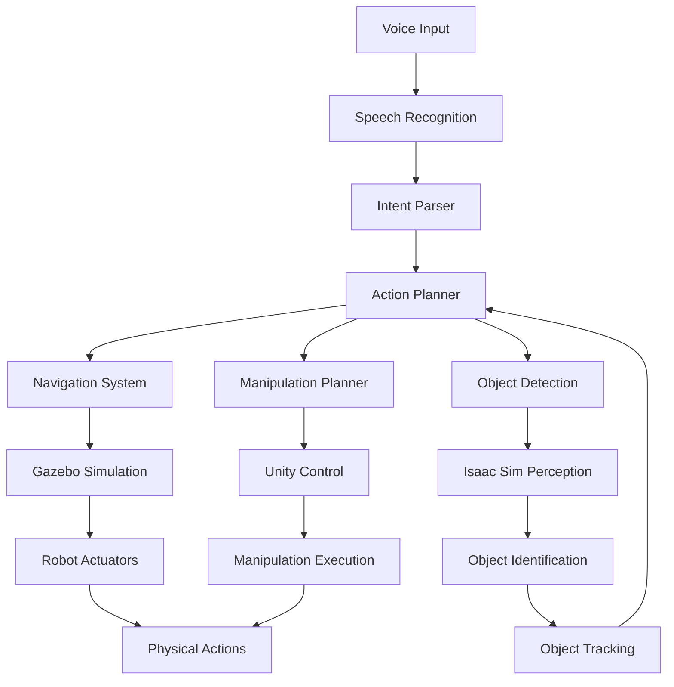

# Capstone Project: Humanoid Robot with Voice Commands

## Overview

Welcome to the capstone project for the Physical AI & Humanoid Robotics textbook! This project brings together all the concepts you've learned throughout the course to build a sophisticated humanoid robot system that can receive voice commands, plan actions, navigate environments, identify objects, and manipulate them.

## Project Goals

By completing this capstone project, you will:

- Integrate ROS 2, Gazebo, Isaac Sim, and Unity in a cohesive system
- Implement voice command recognition using OpenAI Whisper or similar technology
- Create a navigation system for humanoid robot locomotion
- Develop object detection and identification capabilities
- Implement manipulation actions for the humanoid robot
- Design a complete pipeline from voice input to physical action

## Architecture Overview



## System Components

### 1. Voice Command Processing

The system begins with voice command processing. We'll use OpenAI Whisper or a similar speech recognition system to convert spoken commands into text.

```python
# Example voice command processing node
import rclpy
from rclpy.node import Node
from std_msgs.msg import String
import speech_recognition as sr

class VoiceCommandNode(Node):
    def __init__(self):
        super().__init__('voice_command_node')
        self.publisher_ = self.create_publisher(String, 'voice_command', 10)
        self.recognizer = sr.Recognizer()
        self.microphone = sr.Microphone()

        # Start listening for commands
        self.timer = self.create_timer(1.0, self.listen_for_command)

    def listen_for_command(self):
        try:
            with self.microphone as source:
                self.recognizer.adjust_for_ambient_noise(source)
                audio = self.recognizer.listen(source, timeout=5.0)

            command_text = self.recognizer.recognize_google(audio)
            msg = String()
            msg.data = command_text
            self.publisher_.publish(msg)
            self.get_logger().info(f'Heard command: {command_text}')

        except sr.WaitTimeoutError:
            pass  # No command heard
        except Exception as e:
            self.get_logger().error(f'Error processing voice command: {e}')
```

<CodeExample
  title="Voice Command Node"
  language="python"
  description="This example shows how to create a ROS 2 node that listens for voice commands and publishes them as messages."
  expectedOutput="Hearing command: 'Move to the kitchen and pick up the red cup'">
```python
import rclpy
from rclpy.node import Node
from std_msgs.msg import String
import speech_recognition as sr

class VoiceCommandNode(Node):
    def __init__(self):
        super().__init__('voice_command_node')
        self.publisher_ = self.create_publisher(String, 'voice_command', 10)
        self.recognizer = sr.Recognizer()
        self.microphone = sr.Microphone()

        # Start listening for commands
        self.timer = self.create_timer(1.0, self.listen_for_command)

    def listen_for_command(self):
        try:
            with self.microphone as source:
                self.recognizer.adjust_for_ambient_noise(source)
                audio = self.recognizer.listen(source, timeout=5.0)

            command_text = self.recognizer.recognize_google(audio)
            msg = String()
            msg.data = command_text
            self.publisher_.publish(msg)
            self.get_logger().info(f'Heard command: {command_text}')

        except sr.WaitTimeoutError:
            pass  # No command heard
        except Exception as e:
            self.get_logger().error(f'Error processing voice command: {e}')

def main(args=None):
    rclpy.init(args=args)
    voice_command_node = VoiceCommandNode()
    rclpy.spin(voice_command_node)
    voice_command_node.destroy_node()
    rclpy.shutdown()

if __name__ == '__main__':
    main()
```
</CodeExample>

### 2. Intent Parsing and Action Planning

Once we have the voice command as text, we need to parse the intent and plan the appropriate actions:

```python
# Example intent parser
import json
from rclpy.node import Node
from std_msgs.msg import String

class IntentParserNode(Node):
    def __init__(self):
        super().__init__('intent_parser_node')
        self.subscription = self.create_subscription(
            String,
            'voice_command',
            self.command_callback,
            10)
        self.action_publisher = self.create_publisher(String, 'planned_actions', 10)

    def command_callback(self, msg):
        command = msg.data
        parsed_intent = self.parse_command(command)

        # Plan actions based on intent
        actions = self.plan_actions(parsed_intent)

        # Publish planned actions
        action_msg = String()
        action_msg.data = json.dumps(actions)
        self.action_publisher.publish(action_msg)

        self.get_logger().info(f'Planned actions: {actions}')

    def parse_command(self, command):
        # Simple keyword-based parsing (in practice, use NLP models)
        intent = {}

        if 'move' in command or 'go to' in command:
            intent['action'] = 'navigate'
            intent['location'] = self.extract_location(command)
        elif 'pick up' in command or 'grasp' in command:
            intent['action'] = 'manipulate'
            intent['object'] = self.extract_object(command)
        elif 'identify' in command or 'find' in command:
            intent['action'] = 'perceive'
            intent['target'] = self.extract_object(command)

        return intent

    def extract_location(self, command):
        # Extract location from command
        locations = ['kitchen', 'living room', 'bedroom', 'office', 'dining room']
        for loc in locations:
            if loc in command:
                return loc
        return 'unknown'

    def extract_object(self, command):
        # Extract object from command
        objects = ['cup', 'book', 'ball', 'box', 'bottle', 'phone']
        for obj in objects:
            if obj in command:
                return obj
        return 'unknown'

    def plan_actions(self, intent):
        # Plan sequence of actions based on intent
        actions = []

        if intent['action'] == 'navigate':
            actions.append({'type': 'navigate', 'target': intent['location']})
            actions.append({'type': 'look_around', 'duration': 5.0})
        elif intent['action'] == 'manipulate':
            actions.append({'type': 'detect_object', 'target': intent['object']})
            actions.append({'type': 'approach_object', 'target': intent['object']})
            actions.append({'type': 'grasp_object', 'target': intent['object']})
        elif intent['action'] == 'perceive':
            actions.append({'type': 'detect_object', 'target': intent['target']})
            actions.append({'type': 'analyze_object', 'target': intent['target']})

        return actions
```

<CodeExample
  title="Intent Parser Node"
  language="python"
  description="This example shows how to parse voice commands and plan appropriate robotic actions."
  expectedOutput="Planned actions: [{'type': 'navigate', 'target': 'kitchen'}, {'type': 'look_around', 'duration': 5.0}]">
```python
import rclpy
from rclpy.node import Node
from std_msgs.msg import String
import json

class IntentParserNode(Node):
    def __init__(self):
        super().__init__('intent_parser_node')
        self.subscription = self.create_subscription(
            String,
            'voice_command',
            self.command_callback,
            10)
        self.action_publisher = self.create_publisher(String, 'planned_actions', 10)

    def command_callback(self, msg):
        command = msg.data
        parsed_intent = self.parse_command(command)

        # Plan actions based on intent
        actions = self.plan_actions(parsed_intent)

        # Publish planned actions
        action_msg = String()
        action_msg.data = json.dumps(actions)
        self.action_publisher.publish(action_msg)

        self.get_logger().info(f'Planned actions: {actions}')

    def parse_command(self, command):
        # Simple keyword-based parsing (in practice, use NLP models)
        intent = {}

        if 'move' in command or 'go to' in command:
            intent['action'] = 'navigate'
            intent['location'] = self.extract_location(command)
        elif 'pick up' in command or 'grasp' in command:
            intent['action'] = 'manipulate'
            intent['object'] = self.extract_object(command)
        elif 'identify' in command or 'find' in command:
            intent['action'] = 'perceive'
            intent['target'] = self.extract_object(command)

        return intent

    def extract_location(self, command):
        # Extract location from command
        locations = ['kitchen', 'living room', 'bedroom', 'office', 'dining room']
        for loc in locations:
            if loc in command:
                return loc
        return 'unknown'

    def extract_object(self, command):
        # Extract object from command
        objects = ['cup', 'book', 'ball', 'box', 'bottle', 'phone']
        for obj in objects:
            if obj in command:
                return obj
        return 'unknown'

    def plan_actions(self, intent):
        # Plan sequence of actions based on intent
        actions = []

        if intent['action'] == 'navigate':
            actions.append({'type': 'navigate', 'target': intent['location']})
            actions.append({'type': 'look_around', 'duration': 5.0})
        elif intent['action'] == 'manipulate':
            actions.append({'type': 'detect_object', 'target': intent['object']})
            actions.append({'type': 'approach_object', 'target': intent['object']})
            actions.append({'type': 'grasp_object', 'target': intent['object']})
        elif intent['action'] == 'perceive':
            actions.append({'type': 'detect_object', 'target': intent['target']})
            actions.append({'type': 'analyze_object', 'target': intent['target']})

        return actions

def main(args=None):
    rclpy.init(args=args)
    intent_parser_node = IntentParserNode()
    rclpy.spin(intent_parser_node)
    intent_parser_node.destroy_node()
    rclpy.shutdown()

if __name__ == '__main__':
    main()
```
</CodeExample>

### 3. Navigation System

The navigation system will handle the humanoid robot's movement through the environment:

```python
# Example navigation system
import rclpy
from rclpy.node import Node
from geometry_msgs.msg import PoseStamped
from nav_msgs.msg import Path
import numpy as np

class NavigationNode(Node):
    def __init__(self):
        super().__init__('navigation_node')
        self.subscription = self.create_subscription(
            String,
            'planned_actions',
            self.action_callback,
            10)
        self.goal_publisher = self.create_publisher(PoseStamped, 'move_base_simple/goal', 10)

    def action_callback(self, msg):
        action_plan = json.loads(msg.data)

        for action in action_plan:
            if action['type'] == 'navigate':
                self.navigate_to_location(action['target'])

    def navigate_to_location(self, location):
        # Define target poses for different locations
        location_poses = {
            'kitchen': {'x': 2.0, 'y': 1.0, 'theta': 0.0},
            'living room': {'x': -1.0, 'y': 3.0, 'theta': 1.57},
            'bedroom': {'x': 4.0, 'y': -2.0, 'theta': 3.14},
            'office': {'x': -3.0, 'y': -1.0, 'theta': -1.57},
            'dining room': {'x': 0.0, 'y': -3.0, 'theta': 0.0}
        }

        if location in location_poses:
            pose_data = location_poses[location]

            # Create goal pose
            goal_pose = PoseStamped()
            goal_pose.header.stamp = self.get_clock().now().to_msg()
            goal_pose.header.frame_id = 'map'
            goal_pose.pose.position.x = pose_data['x']
            goal_pose.pose.position.y = pose_data['y']
            goal_pose.pose.position.z = 0.0

            # Convert theta to quaternion
            theta = pose_data['theta']
            goal_pose.pose.orientation.z = np.sin(theta / 2.0)
            goal_pose.pose.orientation.w = np.cos(theta / 2.0)

            # Publish goal
            self.goal_publisher.publish(goal_pose)
            self.get_logger().info(f'Navigating to {location} at ({pose_data["x"]}, {pose_data["y"]})')
```

### 4. Object Detection and Manipulation

The system will detect objects and plan manipulation actions:

```python
# Example object detection and manipulation
import rclpy
from rclpy.node import Node
from sensor_msgs.msg import Image
from geometry_msgs.msg import Point
from std_msgs.msg import String
import cv2
import numpy as np

class PerceptionNode(Node):
    def __init__(self):
        super().__init__('perception_node')
        self.subscription = self.create_subscription(
            String,
            'planned_actions',
            self.action_callback,
            10)
        self.image_subscription = self.create_subscription(
            Image,
            'camera/image_raw',
            self.image_callback,
            10)
        self.object_publisher = self.create_publisher(Point, 'detected_object', 10)

        # Simple color-based object detection parameters
        self.object_colors = {
            'red': ([0, 50, 50], [10, 255, 255]),
            'green': ([50, 50, 50], [70, 255, 255]),
            'blue': ([110, 50, 50], [130, 255, 255]),
            'yellow': ([20, 100, 100], [30, 255, 255])
        }

    def action_callback(self, msg):
        action_plan = json.loads(msg.data)

        for action in action_plan:
            if action['type'] == 'detect_object':
                self.detect_object(action['target'])

    def image_callback(self, msg):
        # Convert ROS Image message to OpenCV image
        # (Implementation would depend on the image transport method)
        pass

    def detect_object(self, target_object):
        # In a real implementation, this would process camera images
        # to detect the specified object

        # For this example, we'll simulate detection
        detected_objects = [
            {'name': 'red cup', 'position': Point(x=1.5, y=0.8, z=0.0)},
            {'name': 'blue book', 'position': Point(x=2.1, y=-0.5, z=0.0)},
            {'name': 'yellow ball', 'position': Point(x=-0.3, y=1.2, z=0.0)}
        ]

        for obj in detected_objects:
            if target_object in obj['name']:
                self.object_publisher.publish(obj['position'])
                self.get_logger().info(f'Detected {obj["name"]} at ({obj["position"].x}, {obj["position"].y})')
                return

        self.get_logger().info(f'{target_object} not found in view')
```

## Implementation Pipeline

The complete implementation follows this pipeline:

1. **Voice Input**: Capture spoken commands from the user
2. **Speech Recognition**: Convert speech to text
3. **Intent Parsing**: Understand the user's intent from the text
4. **Action Planning**: Plan a sequence of robotic actions
5. **Navigation**: Move the robot to the appropriate location
6. **Perception**: Detect and identify objects in the environment
7. **Manipulation**: Execute the required manipulation actions
8. **Feedback**: Provide feedback to the user about the action results

## Practical Exercise

<ProgressTracker
  chapterId="capstone-project"
  chapterTitle="Capstone Project: Humanoid Robot with Voice Commands"
  projectSections={[
    { id: 'voice-processing', title: 'Voice Processing Module', completed: false },
    { id: 'intent-parsing', title: 'Intent Parsing System', completed: false },
    { id: 'navigation', title: 'Navigation System', completed: false },
    { id: 'perception', title: 'Perception & Object Detection', completed: false },
    { id: 'manipulation', title: 'Manipulation Planning', completed: false },
    { id: 'integration', title: 'System Integration', completed: false }
  ]}
/>

Now that you understand the architecture, implement the complete pipeline by:

1. Creating a ROS 2 package for the voice command processing
2. Implementing the intent parser with more sophisticated NLP
3. Integrating with a humanoid robot simulation in Gazebo
4. Adding object detection using Isaac Sim perception capabilities
5. Creating Unity-based visualization for the system status


<div class="admonition admonition-hint alert alert--secondary">
  <div class="admonition-heading">
    <h5>Hint</h5>
  </div>
  <div class="admonition-content">

    <h6>Hint</h6>
    

1. Start with the voice command node and work your way through the pipeline
2. Use ROS 2 actions for long-running tasks like navigation
3. Implement proper error handling for each stage
4. Test each component individually before integration
5. Use the Gazebo humanoid robot models for simulation


  </div>
</div>


## Summary

This capstone project demonstrates the integration of multiple robotics technologies:

- **ROS 2** for system integration and communication
- **Gazebo** for robot simulation and navigation testing
- **Isaac Sim** for perception and object detection
- **Unity** for visualization and user interface
- **Voice recognition** for natural human-robot interaction

Successfully completing this project will give you hands-on experience with building complex robotic systems that combine perception, planning, and action execution in a unified framework.

## Next Steps

After completing this capstone project, you should have a comprehensive understanding of:

- How to integrate multiple robotics frameworks and tools
- How to build end-to-end robotic systems with voice interaction
- How to plan and execute complex robotic tasks
- How to handle perception and manipulation in dynamic environments

<ChapterNavigationWrapper currentChapterId="capstone-project" />
