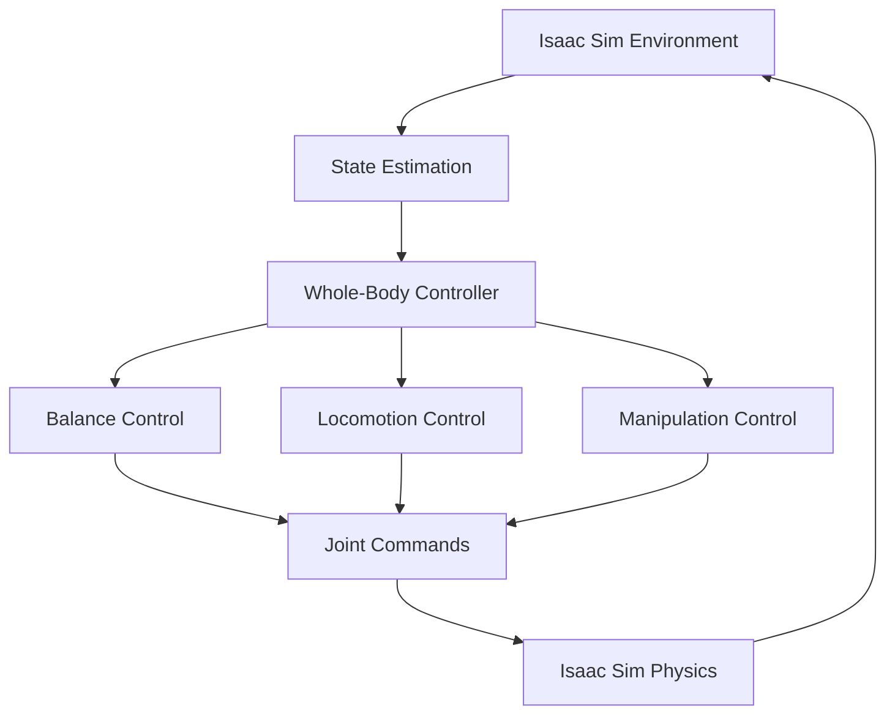

# Isaac Sim Integration

## Introduction to NVIDIA Isaac Sim

NVIDIA Isaac Sim is a powerful robotics simulation environment built on NVIDIA Omniverse. It provides high-fidelity physics simulation, photorealistic rendering, and comprehensive tools for developing, testing, and validating robotics applications. Isaac Sim is particularly valuable for humanoid robotics development as it offers realistic simulation of complex environments, physics interactions, and sensor data.

## Key Features of Isaac Sim

Isaac Sim offers several key capabilities that make it ideal for humanoid robotics development:

- **High-Fidelity Physics**: Accurate simulation of rigid body dynamics, collisions, and complex interactions
- **Photorealistic Rendering**: Realistic visual output for training computer vision models
- **Sensor Simulation**: Comprehensive simulation of cameras, LiDAR, IMU, and other sensors
- **ROS 2 Integration**: Native support for ROS 2 communication and message types
- **Extensive Robot Library**: Pre-built robot models including humanoid platforms
- **Task and Benchmark Environments**: Pre-configured scenarios for testing robot capabilities

## Setting Up Isaac Sim

To get started with Isaac Sim, you'll need to install it following NVIDIA's official documentation. The installation requires a compatible GPU and the Omniverse platform.

```python
# Example: Basic Isaac Sim setup with ROS 2 integration
import omni
from omni.isaac.core import World
from omni.isaac.core.utils.stage import add_reference_to_stage
from omni.isaac.core.utils.nucleus import get_assets_root_path
from omni.isaac.core.robots import Robot
from omxi.isaac.core.utils.viewports import set_camera_view

class IsaacSimEnvironment:
    def __init__(self):
        self.world = World(stage_units_in_meters=1.0)
        self.setup_scene()

    def setup_scene(self):
        # Add a simple room environment
        add_reference_to_stage(
            usd_path="omniverse://localhost/NVIDIA/Assets/Isaac/4.1/Isaac/Environments/Simple_Room.usd",
            prim_path="/World/SimpleRoom"
        )

        # Add a robot (example with a generic manipulator)
        self.robot = self.world.scene.add(
            Robot(
                prim_path="/World/Robot",
                name="my_robot",
                usd_path="omniverse://localhost/NVIDIA/Assets/Isaac/4.1/Isaac/Robots/Franka/franka_panda.usd",
                position=[0, 0, 0],
                orientation=[1, 0, 0, 0]
            )
        )

    def reset(self):
        self.world.reset()

    def step(self, dt=1/60):
        self.world.step(render=True)

    def run_simulation(self, num_steps=1000):
        self.world.play()
        for i in range(num_steps):
            self.step()
            if i % 60 == 0:  # Print every second
                print(f"Simulation step {i}")
        self.world.stop()
```

<CodeExample
  title="Basic Isaac Sim Environment Setup"
  language="python"
  description="This example shows how to create a basic Isaac Sim environment with a robot."
  expectedOutput="Simulation running with robot in the scene">
```python
import omni
from omni.isaac.core import World
from omni.isaac.core.utils.stage import add_reference_to_stage
from omni.isaac.core.utils.nucleus import get_assets_root_path
from omni.isaac.core.robots import Robot

class IsaacSimEnvironment:
    def __init__(self):
        self.world = World(stage_units_in_meters=1.0)
        self.setup_scene()

    def setup_scene(self):
        # Add a simple room environment
        assets_root_path = get_assets_root_path()
        if assets_root_path is None:
            print("Could not find assets root path")
            return

        add_reference_to_stage(
            usd_path=f"{assets_root_path}/Isaac/Environments/Simple_Room.usd",
            prim_path="/World/SimpleRoom"
        )

        # Add a robot (example with a generic manipulator)
        self.robot = self.world.scene.add(
            Robot(
                prim_path="/World/Robot",
                name="my_robot",
                usd_path=f"{assets_root_path}/Isaac/Robots/Franka/franka_panda.usd",
                position=[0, 0, 0],
                orientation=[1, 0, 0, 0]
            )
        )

    def reset(self):
        self.world.reset()

    def step(self, dt=1/60):
        self.world.step(render=True)

    def run_simulation(self, num_steps=1000):
        self.world.play()
        for i in range(num_steps):
            self.step()
            if i % 60 == 0:  # Print every second
                print(f"Simulation step {i}")
        self.world.stop()

def main():
    # Initialize Isaac Sim
    sim_env = IsaacSimEnvironment()
    sim_env.run_simulation(600)  # Run for 10 seconds at 60 FPS
    print("Simulation completed successfully")

if __name__ == "__main__":
    main()
```
</CodeExample>

## Humanoid Robot Integration

Isaac Sim provides excellent support for humanoid robots, allowing for complex multi-joint simulations with realistic physics. Here's how to integrate a humanoid robot:

```python
# Example: Humanoid robot setup in Isaac Sim
from omni.isaac.core.robots import Robot
from omni.isaac.core.articulations import Articulation
from omni.isaac.core.utils.prims import get_prim_at_path
from omni.isaac.core.utils.stage import add_reference_to_stage
import numpy as np

class HumanoidRobot:
    def __init__(self, prim_path, name, usd_path, position, orientation):
        self.robot = Articulation(
            prim_path=prim_path,
            name=name,
            usd_path=usd_path,
            position=position,
            orientation=orientation
        )

        # Get robot information after initialization
        self.num_dof = self.robot.num_dof
        self.joint_names = self.robot.dof_names

    def get_joint_positions(self):
        """Get current joint positions"""
        return self.robot.get_joint_positions()

    def get_joint_velocities(self):
        """Get current joint velocities"""
        return self.robot.get_joint_velocities()

    def set_joint_positions(self, positions):
        """Set desired joint positions"""
        self.robot.set_joint_positions(positions)

    def set_joint_velocities(self, velocities):
        """Set desired joint velocities"""
        self.robot.set_joint_velocities(velocities)

    def apply_joint_efforts(self, efforts):
        """Apply forces/torques to joints"""
        self.robot.set_joint_efforts(efforts)
```

<CodeExample
  title="Humanoid Robot Integration"
  language="python"
  description="This example shows how to integrate a humanoid robot in Isaac Sim with joint control."
  expectedOutput="Humanoid robot initialized with joint control capabilities">
```python
from omni.isaac.core import World
from omni.isaac.core.articulations import Articulation
from omni.isaac.core.utils.stage import add_reference_to_stage
from omni.isaac.core.utils.nucleus import get_assets_root_path
import numpy as np

class HumanoidRobot:
    def __init__(self, world, prim_path, name, usd_path, position, orientation):
        self.world = world
        self.robot = Articulation(
            prim_path=prim_path,
            name=name,
            usd_path=usd_path,
            position=position,
            orientation=orientation
        )

        # Get robot information after initialization
        self.num_dof = self.robot.num_dof
        self.joint_names = self.robot.dof_names

    def get_joint_positions(self):
        """Get current joint positions"""
        return self.robot.get_joint_positions()

    def get_joint_velocities(self):
        """Get current joint velocities"""
        return self.robot.get_joint_velocities()

    def set_joint_positions(self, positions):
        """Set desired joint positions"""
        self.robot.set_joint_positions(positions)

    def set_joint_velocities(self, velocities):
        """Set desired joint velocities"""
        self.robot.set_joint_velocities(velocities)

    def apply_joint_efforts(self, efforts):
        """Apply forces/torques to joints"""
        self.robot.set_joint_efforts(efforts)

# Example usage
def setup_humanoid_simulation():
    world = World(stage_units_in_meters=1.0)

    # Add a ground plane
    add_reference_to_stage(
        usd_path="omniverse://localhost/NVIDIA/Assets/Isaac/4.1/Isaac/Environments/Simple_Room.usd",
        prim_path="/World/SimpleRoom"
    )

    # Initialize assets root path
    assets_root_path = get_assets_root_path()
    if assets_root_path is None:
        print("Could not find assets root path")
        return None, None

    # Create humanoid robot (using a generic articulated robot as example)
    humanoid = HumanoidRobot(
        world=world,
        prim_path="/World/Humanoid",
        name="my_humanoid",
        usd_path=f"{assets_root_path}/Isaac/Robots/NVIDIA/isaac_sim_suite/nv_humannoid.usd",
        position=[0, 0, 1.0],
        orientation=[1, 0, 0, 0]
    )

    return world, humanoid

def run_humanoid_control():
    world, humanoid = setup_humanoid_simulation()
    if world is None:
        print("Failed to setup simulation")
        return

    world.play()

    # Example control loop
    for step in range(1000):
        world.step(render=True)

        # Simple example: move joints to zero position
        if step == 0:
            # Initialize to zero positions
            zero_positions = np.zeros(humanoid.num_dof)
            humanoid.set_joint_positions(zero_positions)

        if step % 60 == 0:  # Every second
            print(f"Step {step}: Joint positions = {humanoid.get_joint_positions()}")

    world.stop()
    print("Humanoid simulation completed")

if __name__ == "__main__":
    run_humanoid_control()
```
</CodeExample>

## Sensor Integration

Isaac Sim provides comprehensive sensor simulation that's crucial for humanoid robot development:

```python
# Example: Sensor integration in Isaac Sim
from omni.isaac.sensor import Camera
from omni.isaac.core.sensors import ImuSensor, ContactSensor
from omni.isaac.core.utils.prims import define_prim
import numpy as np

class RobotWithSensors:
    def __init__(self, robot_prim_path):
        self.robot_prim_path = robot_prim_path
        self.setup_sensors()

    def setup_sensors(self):
        # Add RGB camera to the robot
        self.camera = Camera(
            prim_path=f"{self.robot_prim_path}/camera",
            name="robot_camera",
            translation=np.array([0.3, 0.0, 0.1]),
            orientation=np.array([0.5, -0.5, 0.5, -0.5])  # Rotate to look forward
        )

        # Add IMU sensor
        self.imu = ImuSensor(
            prim_path=f"{self.robot_prim_path}/imu",
            name="robot_imu",
            translation=np.array([0.0, 0.0, 0.5])
        )

        # Add contact sensors to feet for ground contact detection
        self.left_foot_contact = ContactSensor(
            prim_path=f"{self.robot_prim_path}/left_foot_contact",
            name="left_foot_contact",
            translation=np.array([0.0, 0.1, -0.8])
        )

        self.right_foot_contact = ContactSensor(
            prim_path=f"{self.robot_prim_path}/right_foot_contact",
            name="right_foot_contact",
            translation=np.array([0.0, -0.1, -0.8])
        )

    def get_camera_data(self):
        """Get RGB camera data"""
        return self.camera.get_rgb()

    def get_imu_data(self):
        """Get IMU sensor data"""
        return self.imu.get_measured_value()

    def get_contact_data(self):
        """Get contact sensor data"""
        left_contact = self.left_foot_contact.get_measurements()
        right_contact = self.right_foot_contact.get_measurements()
        return left_contact, right_contact
```

## ROS 2 Integration

Isaac Sim provides excellent integration with ROS 2 for communication with external systems:

```python
# Example: ROS 2 integration with Isaac Sim
import rclpy
from rclpy.node import Node
from sensor_msgs.msg import Image, Imu, JointState
from geometry_msgs.msg import Twist
from std_msgs.msg import Float64MultiArray
import numpy as np

class IsaacSimRosBridge(Node):
    def __init__(self):
        super().__init__('isaac_sim_ros_bridge')

        # Publishers for sensor data
        self.camera_pub = self.create_publisher(Image, '/camera/image_raw', 10)
        self.imu_pub = self.create_publisher(Imu, '/imu/data', 10)
        self.joint_state_pub = self.create_publisher(JointState, '/joint_states', 10)

        # Subscribers for commands
        self.cmd_vel_sub = self.create_subscription(
            Twist, '/cmd_vel', self.cmd_vel_callback, 10
        )
        self.joint_cmd_sub = self.create_subscription(
            Float64MultiArray, '/joint_commands', self.joint_cmd_callback, 10
        )

        # Timer for publishing sensor data
        self.timer = self.create_timer(0.033, self.publish_sensor_data)  # ~30 Hz

        self.get_logger().info('Isaac Sim ROS Bridge initialized')

    def cmd_vel_callback(self, msg):
        """Handle velocity commands"""
        # Process velocity command for differential drive or other control
        linear_vel = msg.linear.x
        angular_vel = msg.angular.z
        self.get_logger().info(f'Received velocity command: linear={linear_vel}, angular={angular_vel}')

    def joint_cmd_callback(self, msg):
        """Handle joint position commands"""
        joint_positions = np.array(msg.data)
        self.get_logger().info(f'Received joint commands for {len(joint_positions)} joints')

    def publish_sensor_data(self):
        """Publish sensor data to ROS topics"""
        # This would interface with Isaac Sim to get actual sensor data
        # For this example, we'll publish dummy data
        joint_state_msg = JointState()
        joint_state_msg.name = ['joint1', 'joint2', 'joint3']
        joint_state_msg.position = [0.1, 0.2, 0.3]
        joint_state_msg.velocity = [0.0, 0.0, 0.0]
        joint_state_msg.effort = [0.0, 0.0, 0.0]

        self.joint_state_pub.publish(joint_state_msg)
```

<CodeExample
  title="ROS 2 Integration"
  language="python"
  description="This example shows how to bridge Isaac Sim with ROS 2 for sensor data and control commands."
  expectedOutput="ROS 2 node running with publishers and subscribers for Isaac Sim integration">
```python
import rclpy
from rclpy.node import Node
from sensor_msgs.msg import Image, Imu, JointState
from geometry_msgs.msg import Twist
from std_msgs.msg import Float64MultiArray
import numpy as np

class IsaacSimRosBridge(Node):
    def __init__(self):
        super().__init__('isaac_sim_ros_bridge')

        # Publishers for sensor data
        self.camera_pub = self.create_publisher(Image, '/camera/image_raw', 10)
        self.imu_pub = self.create_publisher(Imu, '/imu/data', 10)
        self.joint_state_pub = self.create_publisher(JointState, '/joint_states', 10)

        # Subscribers for commands
        self.cmd_vel_sub = self.create_subscription(
            Twist, '/cmd_vel', self.cmd_vel_callback, 10
        )
        self.joint_cmd_sub = self.create_subscription(
            Float64MultiArray, '/joint_commands', self.joint_cmd_callback, 10
        )

        # Timer for publishing sensor data
        self.timer = self.create_timer(0.033, self.publish_sensor_data)  # ~30 Hz

        self.get_logger().info('Isaac Sim ROS Bridge initialized')

    def cmd_vel_callback(self, msg):
        """Handle velocity commands"""
        # Process velocity command for differential drive or other control
        linear_vel = msg.linear.x
        angular_vel = msg.angular.z
        self.get_logger().info(f'Received velocity command: linear={linear_vel}, angular={angular_vel}')

    def joint_cmd_callback(self, msg):
        """Handle joint position commands"""
        joint_positions = np.array(msg.data)
        self.get_logger().info(f'Received joint commands for {len(joint_positions)} joints')

    def publish_sensor_data(self):
        """Publish sensor data to ROS topics"""
        # This would interface with Isaac Sim to get actual sensor data
        # For this example, we'll publish dummy data
        joint_state_msg = JointState()
        joint_state_msg.header.stamp = self.get_clock().now().to_msg()
        joint_state_msg.name = ['joint1', 'joint2', 'joint3', 'joint4', 'joint5', 'joint6']
        joint_state_msg.position = [0.1, 0.2, 0.3, 0.4, 0.5, 0.6]
        joint_state_msg.velocity = [0.0, 0.0, 0.0, 0.0, 0.0, 0.0]
        joint_state_msg.effort = [0.0, 0.0, 0.0, 0.0, 0.0, 0.0]

        self.joint_state_pub.publish(joint_state_msg)

def main(args=None):
    rclpy.init(args=args)
    bridge_node = IsaacSimRosBridge()

    try:
        rclpy.spin(bridge_node)
    except KeyboardInterrupt:
        pass
    finally:
        bridge_node.destroy_node()
        rclpy.shutdown()

if __name__ == '__main__':
    main()
```
</CodeExample>

## Advanced Control Techniques

For humanoid robots, advanced control techniques are essential for stable locomotion and manipulation:



## Practical Exercise

<ProgressTracker chapterId="isaac-sim" chapterTitle="Isaac Sim Integration" />

Create a complete humanoid robot simulation in Isaac Sim that includes:

1. Load a humanoid robot model with realistic joint constraints
2. Implement basic walking gait using inverse kinematics
3. Add sensor feedback for balance control
4. Integrate with ROS 2 for external control


<div class="admonition admonition-hint alert alert--secondary">
  <div class="admonition-heading">
    <h5>Hint</h5>
  </div>
  <div class="admonition-content">
    <ol>


<li>Start with a simple standing controller before attempting walking</li>
<li>Use PD controllers for joint position control</li>
<li>Implement a simple balance controller using IMU feedback</li>
<li>Test with small movements before complex behaviors</li>
<li>Use the Isaac Sim examples as reference for best practices</li>


    </ol>
  </div>
</div>


## Summary

Isaac Sim provides a comprehensive simulation environment for humanoid robotics development with:

- High-fidelity physics simulation for realistic robot interactions
- Photorealistic rendering for computer vision training
- Extensive sensor simulation capabilities
- Native ROS 2 integration
- Pre-built robot models and environments
- Tools for testing and validation of robotic algorithms

The combination of realistic physics, sensor simulation, and ROS 2 integration makes Isaac Sim an invaluable tool for developing and testing humanoid robot applications before deployment on real hardware.

## Next Steps

After completing this chapter, you should be ready to explore:

- [Vision-Language-Action Models](../chapters/vla-models)
- [Capstone Project](../chapters/capstone-project)

<ChapterNavigationWrapper currentChapterId="isaac-sim" />
