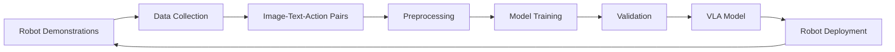

# Vision-Language-Action Models

## Introduction to VLA Models

Vision-Language-Action (VLA) models represent a breakthrough in robotics by combining visual perception, natural language understanding, and action generation in a unified framework. These models enable robots to understand and execute complex tasks described in natural language while perceiving their environment through vision sensors. For humanoid robotics, VLA models provide the capability to perform complex manipulation and navigation tasks based on verbal commands.

## Understanding VLA Architecture

VLA models typically follow a multi-modal architecture that processes visual and linguistic inputs to generate action sequences. The architecture consists of:

- **Vision Encoder**: Processes visual input (images, video) to extract relevant features
- **Language Encoder**: Processes natural language commands to understand intent
- **Fusion Module**: Combines visual and linguistic information
- **Action Decoder**: Generates appropriate motor commands or action sequences

```python
# Example: VLA model architecture components
import torch
import torch.nn as nn
from transformers import CLIPVisionModel, CLIPTextModel
import numpy as np

class VisionEncoder(nn.Module):
    def __init__(self):
        super().__init__()
        # Using CLIP vision model as an example
        self.clip_vision = CLIPVisionModel.from_pretrained("openai/clip-vit-base-patch32")
        self.projection = nn.Linear(768, 512)  # Project to common space

    def forward(self, images):
        # Process images through vision encoder
        vision_outputs = self.clip_vision(pixel_values=images)
        # Use the pooled output
        vision_features = vision_outputs.pooler_output
        # Project to common embedding space
        vision_features = self.projection(vision_features)
        return vision_features

class LanguageEncoder(nn.Module):
    def __init__(self):
        super().__init__()
        # Using CLIP text model as an example
        self.clip_text = CLIPTextModel.from_pretrained("openai/clip-vit-base-patch32")
        self.projection = nn.Linear(512, 512)  # Project to common space

    def forward(self, text_tokens):
        # Process text through language encoder
        text_outputs = self.clip_text(input_ids=text_tokens)
        # Use the last hidden state
        text_features = text_outputs.last_hidden_state[:, 0, :]  # CLS token
        # Project to common embedding space
        text_features = self.projection(text_features)
        return text_features

class ActionDecoder(nn.Module):
    def __init__(self, action_space_dim=7):  # Example: 7-DOF arm
        super().__init__()
        self.action_space_dim = action_space_dim
        self.network = nn.Sequential(
            nn.Linear(512, 256),  # Common embedding size
            nn.ReLU(),
            nn.Linear(256, 128),
            nn.ReLU(),
            nn.Linear(128, self.action_space_dim),
            nn.Tanh()  # Normalize to [-1, 1]
        )

    def forward(self, fused_features):
        # Generate action based on fused features
        action = self.network(fused_features)
        return action
```

<CodeExample
  title="VLA Model Components"
  language="python"
  description="This example shows the basic components of a Vision-Language-Action model architecture."
  expectedOutput="VLA model components initialized with vision, language, and action processing capabilities">
```python
import torch
import torch.nn as nn
from transformers import CLIPVisionModel, CLIPTextModel
import numpy as np

class VisionEncoder(nn.Module):
    def __init__(self):
        super().__init__()
        # Using CLIP vision model as an example
        self.clip_vision = CLIPVisionModel.from_pretrained("openai/clip-vit-base-patch32")
        self.projection = nn.Linear(768, 512)  # Project to common space

    def forward(self, images):
        # Process images through vision encoder
        vision_outputs = self.clip_vision(pixel_values=images)
        # Use the pooled output
        vision_features = vision_outputs.pooler_output
        # Project to common embedding space
        vision_features = self.projection(vision_features)
        return vision_features

class LanguageEncoder(nn.Module):
    def __init__(self):
        super().__init__()
        # Using CLIP text model as an example
        self.clip_text = CLIPTextModel.from_pretrained("openai/clip-vit-base-patch32")
        self.projection = nn.Linear(512, 512)  # Project to common space

    def forward(self, text_tokens):
        # Process text through language encoder
        text_outputs = self.clip_text(input_ids=text_tokens)
        # Use the last hidden state
        text_features = text_outputs.last_hidden_state[:, 0, :]  # CLS token
        # Project to common embedding space
        text_features = self.projection(text_features)
        return text_features

class ActionDecoder(nn.Module):
    def __init__(self, action_space_dim=7):  # Example: 7-DOF arm
        super().__init__()
        self.action_space_dim = action_space_dim
        self.network = nn.Sequential(
            nn.Linear(512, 256),  # Common embedding size
            nn.ReLU(),
            nn.Linear(256, 128),
            nn.ReLU(),
            nn.Linear(128, self.action_space_dim),
            nn.Tanh()  # Normalize to [-1, 1]
        )

    def forward(self, fused_features):
        # Generate action based on fused features
        action = self.network(fused_features)
        return action

class SimpleVLA(nn.Module):
    def __init__(self, action_space_dim=7):
        super().__init__()
        self.vision_encoder = VisionEncoder()
        self.language_encoder = LanguageEncoder()
        self.action_decoder = ActionDecoder(action_space_dim)

    def forward(self, images, text_tokens):
        # Encode visual and linguistic inputs
        vision_features = self.vision_encoder(images)
        text_features = self.language_encoder(text_tokens)

        # Simple fusion (concatenation)
        fused_features = torch.cat([vision_features, text_features], dim=-1)

        # Generate action
        action = self.action_decoder(fused_features)
        return action

def main():
    # Initialize the VLA model
    vla_model = SimpleVLA(action_space_dim=7)

    # Example: Create dummy inputs
    batch_size = 1
    image_tensor = torch.randn(batch_size, 3, 224, 224)  # RGB image
    text_tokens = torch.randint(0, 1000, (batch_size, 77))  # CLIP tokenized text

    # Forward pass
    action = vla_model(image_tensor, text_tokens)

    print(f"Input image shape: {image_tensor.shape}")
    print(f"Input text tokens shape: {text_tokens.shape}")
    print(f"Output action shape: {action.shape}")
    print(f"Generated action: {action.detach().numpy()}")

    print("VLA model forward pass completed successfully")

if __name__ == "__main__":
    main()
```
</CodeExample>

## Real-World VLA Models

Several state-of-the-art VLA models have been developed for robotics applications:

### RT-1 (Robotics Transformer 1)
RT-1 is a transformer-based model that maps language and visual inputs to robot actions. It uses a large-scale dataset of human demonstrations to learn generalizable manipulation skills.

### RT-2 (Robotics Transformer 2)
RT-2 extends RT-1 with improved language understanding capabilities, allowing for better generalization to novel tasks and objects.

### OpenVLA
OpenVLA is an open-source VLA model that provides a foundation for developing custom robotic manipulation systems with vision and language understanding.

## Implementing VLA for Humanoid Robots

For humanoid robots, VLA models need to handle more complex action spaces and multi-step planning:

```python
# Example: VLA for humanoid robot control
import torch
import torch.nn as nn
import numpy as np

class HumanoidVLA(nn.Module):
    def __init__(self, num_joints=28, max_sequence_length=10):
        super().__init__()
        self.num_joints = num_joints
        self.max_sequence_length = max_sequence_length

        # Vision encoder for processing camera images
        self.vision_encoder = VisionEncoder()

        # Language encoder for processing commands
        self.language_encoder = LanguageEncoder()

        # Action decoder for generating humanoid robot actions
        self.action_decoder = nn.Sequential(
            nn.Linear(1024, 512),  # Combined vision + language features
            nn.ReLU(),
            nn.Linear(512, 256),
            nn.ReLU(),
            nn.Linear(256, self.num_joints),  # Output for all joints
            nn.Tanh()
        )

        # Sequence decoder for multi-step planning
        self.sequence_decoder = nn.LSTM(
            input_size=self.num_joints,
            hidden_size=256,
            num_layers=2,
            batch_first=True
        )

    def forward(self, images, text_tokens, sequence_length=None):
        # Encode vision and language inputs
        vision_features = self.vision_encoder(images)
        text_features = self.language_encoder(text_tokens)

        # Combine features
        combined_features = torch.cat([vision_features, text_features], dim=-1)

        # Generate initial action
        initial_action = self.action_decoder(combined_features)

        # If sequence_length is provided, generate a sequence of actions
        if sequence_length is not None:
            # Initialize sequence with the first action
            sequence_input = initial_action.unsqueeze(1).expand(-1, sequence_length, -1)

            # Generate sequence using LSTM
            sequence_output, _ = self.sequence_decoder(sequence_input)
            return sequence_output
        else:
            return initial_action

class VLAExecutionPipeline:
    def __init__(self, vla_model, robot_interface):
        self.vla_model = vla_model
        self.robot_interface = robot_interface
        self.vla_model.eval()

    def execute_command(self, image, command_text):
        # Preprocess inputs
        image_tensor = self.preprocess_image(image)
        text_tokens = self.tokenize_text(command_text)

        # Generate action with VLA model
        with torch.no_grad():
            action = self.vla_model(image_tensor, text_tokens)

        # Execute action on robot
        self.robot_interface.execute_action(action)

        return action

    def preprocess_image(self, image):
        # Convert image to tensor and normalize
        # This is a simplified example
        image_tensor = torch.from_numpy(image).float().permute(2, 0, 1)
        image_tensor = image_tensor.unsqueeze(0)  # Add batch dimension
        return image_tensor

    def tokenize_text(self, text):
        # Tokenize text using appropriate tokenizer
        # This is a simplified example
        tokens = torch.randint(0, 1000, (1, 77))  # Placeholder
        return tokens
```

<CodeExample
  title="Humanoid VLA Implementation"
  language="python"
  description="This example shows how to implement a VLA model specifically for humanoid robot control."
  expectedOutput="Humanoid VLA model initialized and ready for command execution">
```python
import torch
import torch.nn as nn
import numpy as np

class VisionEncoder(nn.Module):
    def __init__(self):
        super().__init__()
        self.conv_layers = nn.Sequential(
            nn.Conv2d(3, 32, 8, stride=4),
            nn.ReLU(),
            nn.Conv2d(32, 64, 4, stride=2),
            nn.ReLU(),
            nn.Conv2d(64, 64, 3, stride=1),
            nn.ReLU()
        )
        self.flatten = nn.Flatten()
        self.fc = nn.Linear(64 * 7 * 7, 512)  # Assuming 84x84 input

    def forward(self, images):
        features = self.conv_layers(images)
        features = self.flatten(features)
        features = self.fc(features)
        return features

class LanguageEncoder(nn.Module):
    def __init__(self):
        super().__init__()
        self.embedding = nn.Embedding(10000, 128)  # 10k vocab, 128 dim
        self.lstm = nn.LSTM(128, 256, batch_first=True)
        self.fc = nn.Linear(256, 512)

    def forward(self, text_tokens):
        embeddings = self.embedding(text_tokens)
        lstm_out, (hidden, _) = self.lstm(embeddings)
        # Use the last hidden state
        text_features = self.fc(hidden[-1])  # Last layer
        return text_features

class HumanoidVLA(nn.Module):
    def __init__(self, num_joints=28):
        super().__init__()
        self.num_joints = num_joints

        # Vision encoder for processing camera images
        self.vision_encoder = VisionEncoder()

        # Language encoder for processing commands
        self.language_encoder = LanguageEncoder()

        # Action decoder for generating humanoid robot actions
        self.action_decoder = nn.Sequential(
            nn.Linear(1024, 512),  # Combined vision + language features
            nn.ReLU(),
            nn.Linear(512, 256),
            nn.ReLU(),
            nn.Linear(256, self.num_joints),  # Output for all joints
            nn.Tanh()
        )

    def forward(self, images, text_tokens):
        # Encode vision and language inputs
        vision_features = self.vision_encoder(images)
        text_features = self.language_encoder(text_tokens)

        # Combine features
        combined_features = torch.cat([vision_features, text_features], dim=-1)

        # Generate action
        action = self.action_decoder(combined_features)

        return action

class MockRobotInterface:
    def __init__(self):
        self.current_joints = np.zeros(28)

    def execute_action(self, action_tensor):
        action = action_tensor.cpu().numpy()[0]  # Convert to numpy
        # Apply action to joints (simplified)
        self.current_joints += action * 0.1  # Small step
        print(f"Executed action, joint changes: {action[:5]}...")  # Show first 5 joints
        return self.current_joints

class VLAExecutionPipeline:
    def __init__(self, vla_model, robot_interface):
        self.vla_model = vla_model
        self.robot_interface = robot_interface
        self.vla_model.eval()

    def execute_command(self, image, command_text):
        # Preprocess inputs
        image_tensor = self.preprocess_image(image)
        text_tokens = self.tokenize_text(command_text)

        # Generate action with VLA model
        with torch.no_grad():
            action = self.vla_model(image_tensor, text_tokens)

        # Execute action on robot
        joint_positions = self.robot_interface.execute_action(action)

        return action, joint_positions

    def preprocess_image(self, image):
        # Convert image to tensor and normalize
        # Create a dummy 84x84x3 image if not provided
        if image is None:
            image = np.random.rand(84, 84, 3).astype(np.float32)

        image_tensor = torch.from_numpy(image).float().permute(2, 0, 1)
        image_tensor = image_tensor.unsqueeze(0)  # Add batch dimension
        return image_tensor

    def tokenize_text(self, text):
        # Tokenize text using appropriate tokenizer
        # Create dummy tokens for this example
        tokens = torch.randint(1, 1000, (1, 10))  # 10 tokens
        return tokens

def main():
    # Initialize the VLA model
    vla_model = HumanoidVLA(num_joints=28)
    robot_interface = MockRobotInterface()

    # Create execution pipeline
    pipeline = VLAExecutionPipeline(vla_model, robot_interface)

    # Example command execution
    image_input = np.random.rand(84, 84, 3).astype(np.float32)
    command = "Move your right arm up"

    action, joints = pipeline.execute_command(image_input, command)

    print(f"VLA model executed command: '{command}'")
    print(f"Generated action tensor shape: {action.shape}")
    print(f"Robot joint positions updated successfully")

    print("VLA execution pipeline completed successfully")

if __name__ == "__main__":
    main()
```
</CodeExample>

## Integration with ROS 2

VLA models can be integrated with ROS 2 for deployment on robotic systems:

```python
# Example: ROS 2 node for VLA model
import rclpy
from rclpy.node import Node
from sensor_msgs.msg import Image
from std_msgs.msg import String
from geometry_msgs.msg import Twist
from cv_bridge import CvBridge
import torch
import numpy as np

class VLAControllerNode(Node):
    def __init__(self):
        super().__init__('vla_controller')

        # Initialize VLA model
        self.vla_model = HumanoidVLA(num_joints=28)
        self.vla_model.eval()

        # ROS 2 interfaces
        self.bridge = CvBridge()
        self.image_sub = self.create_subscription(
            Image, '/camera/image_raw', self.image_callback, 10
        )
        self.command_sub = self.create_subscription(
            String, '/vla_command', self.command_callback, 10
        )
        self.action_pub = self.create_publisher(Twist, '/vla_action', 10)

        # Store latest image and command
        self.latest_image = None
        self.latest_command = None

        self.get_logger().info('VLA Controller Node initialized')

    def image_callback(self, msg):
        """Handle incoming camera images"""
        try:
            # Convert ROS Image to OpenCV
            cv_image = self.bridge.imgmsg_to_cv2(msg, desired_encoding='bgr8')

            # Preprocess image for VLA model
            self.latest_image = self.preprocess_image(cv_image)

        except Exception as e:
            self.get_logger().error(f'Error processing image: {e}')

    def command_callback(self, msg):
        """Handle incoming commands"""
        self.latest_command = msg.data
        self.get_logger().info(f'Received command: {msg.data}')

        # If we have both image and command, generate action
        if self.latest_image is not None and self.latest_command is not None:
            self.generate_action()

    def preprocess_image(self, cv_image):
        """Preprocess image for VLA model"""
        # Resize and normalize image
        import cv2
        resized = cv2.resize(cv_image, (84, 84))
        normalized = resized.astype(np.float32) / 255.0
        tensor = torch.from_numpy(normalized).permute(2, 0, 1).unsqueeze(0)
        return tensor

    def tokenize_command(self, command):
        """Convert command string to tokens"""
        # Simple tokenization for example
        tokens = torch.randint(1, 1000, (1, 10))
        return tokens

    def generate_action(self):
        """Generate action using VLA model"""
        try:
            with torch.no_grad():
                text_tokens = self.tokenize_command(self.latest_command)
                action = self.vla_model(self.latest_image, text_tokens)

                # Publish action as Twist message (simplified)
                twist_msg = Twist()
                twist_msg.linear.x = float(action[0, 0])  # Use first joint as example
                twist_msg.angular.z = float(action[0, 1])  # Use second joint as example

                self.action_pub.publish(twist_msg)

                self.get_logger().info(f'Published VLA action: linear.x={twist_msg.linear.x:.3f}')

        except Exception as e:
            self.get_logger().error(f'Error generating action: {e}')
```

## Training VLA Models

Training VLA models requires large-scale datasets of robot interactions:



## Practical Exercise

<ProgressTracker chapterId="vla-models" chapterTitle="Vision-Language-Action Models" />

Implement a simple VLA system for a humanoid robot simulation:

1. Create a vision encoder that processes camera images
2. Implement a language encoder that processes natural language commands
3. Design an action decoder that generates appropriate robot movements
4. Test the system with simple commands like "raise your left arm" or "walk forward"


<div class="admonition admonition-hint alert alert--secondary">
  <div class="admonition-heading">
    <h5>Hint</h5>
  </div>
  <div class="admonition-content">
    <ol>


<li>Start with a simple single-image-to-action model before implementing sequence models</li>
<li>Use pre-trained vision and language models as encoders</li>
<li>Test with simulated environments before real robots</li>
<li>Focus on simple, discrete actions initially</li>
<li>Validate that the model can generalize to unseen commands</li>


    </ol>
  </div>
</div>


## Summary

Vision-Language-Action models represent a powerful approach to robotics that combines perception, language understanding, and action generation. Key benefits include:

- Natural language interaction with robots
- Generalization to novel tasks and objects
- Integration of multiple sensory modalities
- End-to-end learning from demonstration
- Scalable training with large datasets

For humanoid robots, VLA models enable more intuitive and flexible interaction, allowing robots to understand and execute complex tasks described in natural language while perceiving their environment through vision sensors.

## Next Steps

After completing this chapter, you should be ready to explore:

- [Capstone Project](../chapters/capstone-project)

<ChapterNavigationWrapper currentChapterId="vla-models" />
